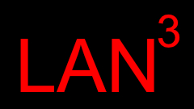

LAN3 is based on the design by Martin Aubé - 
[GitHub](https://github.com/aubema/lancube) - [WiKi](http://obsand.org/wiki/index.php?n=Prof.LANcube) - 
[Licensed under CC BY-SA 4.0 ](https://creativecommons.org/licenses/by-sa/4.0/)

## What is it?
LAN3 is a device that is designed to sample spectral and directional properties of lightsources in the urban or natural environments. In other words, it allows you to place this device on top of your vehicle, drive around and capture exeact phyisical location of each light source along the way, characterize each light's color temperature, and its spectrum. 

## Changes in this version
This version of LAN3 exapands the original design with the follwing changes:
### Hardware Changes 
 - Addtion of the control panel - display and 4-button interface.
 - Addition of newly designed PCBs for both the control panel and the main part of the device.
 - Replacement of the external enclosure with the off-the-shelf box.
 - Transition to use of internal battery and battery monitoring for standalone operation.
 - Integration of the GPS on the interior of the device.

### Software Chages
 - Moving web server from Apache to Nginx.
 - Implementation of GPSd.
 - Automated time sync wiht GPS.
 - Addtion of full-featured web interface including device control, status management, and file management.
 - Change of how GPS status was reported from counting number of satelies to GPS mode. 
 - Requiring GPS Mode 3 (3D lock/high precision) to capture valid data.
 
## Build
The LAN3 is designed with off-the-shelf parts, available from Amazon, Ali Express, and may other places that sell DIY electronic components.

If you would like to build your own, head over the [Hardware](./Hardware/) section. There, you will find list of all the components, gerber files for PCBs, STL file for 3D printed part of the enclosure, and the assembly instructions.

For the software, pre-made IMG file is available that can be expanded onto an SD card. The [Software](./Softwre/) section has the details on how to provision your LAN3, allowing you to set your host and hotspot name. 

## Use
New interface is designed to make in-the-field data capture very simple:
1) Place the LAN3 on top of the vehicle. If possible, use a thin, dark fabric under the LAN3 to eliminate reflected light from impacting the measurements.
2) Press the "Power On" button.
3) Allow LAN3 to boot, to get a GPS lock, and to sync the time. The display will show "GPS Lock: Yes" and "GPS Time: Yes" when this is complete.
4) Press the "Start Measurement" button. The status on the display will show "Measuring".
5) Drive slowly around the area that you want to measure.
6) Once complete, press the "Stop Measurement" button.
7) Connect to the LAN3 hotspot, open your browser, go to the IP address on the LAN3 display, head over to the Files section, and download the file containing your measurements. 

## Data
Changes in this version of LAN3 were primarly focused on hardware and some of the software that supports that hardware. The core process of data capture has not changed. For data analysis and mapping after data has been captured, you will need to use the original LANCube analysis scripts. These are available on Martin Aubé's [GitHub](https://github.com/aubema/lancube) and in the [Original LANcube Archive](./Original_LANcube_Archive/) folder of this repo.

### Sample LAN3 Data
| Sensor | Year | Month | Day | Hour | Minute | Second | Latitude  | Longitude  | Altitude | GPSMode | Gain | AcquisitionTime(ms) | ColorTemperature(k) | MSI  | lux   | Red  | Green | Blue | Clear | Flag |
|--------|------|-------|-----|------|--------|--------|-----------|------------|----------|---------|------|---------------------|---------------------|------|-------|------|-------|------|-------|------|
| S1     | 2024 | 1     | 24  | 0    | 44     | 20.71  | 41.895442 | -87.654126 | 183.2    | 3       | 60   | 307.2               | 5875                | 0.6  | 49.57 | 2444 | 3094  | 2428 | 8301  | OK   |
| S2     | 2024 | 1     | 24  | 0    | 44     | 20.71  | 41.895442 | -87.654126 | 183.2    | 3       | 60   | 153.6               | 7201                | 0.67 | 37.14 | 745  | 1146  | 957  | 2825  | OK   |
| S3     | 2024 | 1     | 24  | 0    | 44     | 20.71  | 41.895442 | -87.654126 | 183.2    | 3       | 60   | 307.2               | 7820                | 0.7  | 31.84 | 1255 | 1996  | 1718 | 5100  | OK   |
| S4     | 2024 | 1     | 24  | 0    | 44     | 20.71  | 41.895442 | -87.654126 | 183.2    | 3       | 60   | 153.6               | 2429                | 0.49 | 24.89 | 1943 | 1236  | 1010 | 4064  | OK   |
| S5     | 2024 | 1     | 24  | 0    | 44     | 20.71  | 41.895442 | -87.654126 | 183.2    | 3       | 60   | 614.4               | 5933                | 0.59 | 28.73 | 2413 | 3388  | 2573 | 8782  | OK   |
| S1     | 2024 | 1     | 24  | 0    | 44     | 21.34  | 41.895512 | -87.65423  | 183.2    | 3       | 60   | 307.2               | 6572                | 0.63 | 40.83 | 1575 | 2414  | 1904 | 6225  | OK   |
| S2     | 2024 | 1     | 24  | 0    | 44     | 21.34  | 41.895512 | -87.65423  | 183.2    | 3       | 60   | 153.6               | 7077                | 0.65 | 47.39 | 793  | 1376  | 1105 | 3314  | OK   |
| S3     | 2024 | 1     | 24  | 0    | 44     | 21.34  | 41.895512 | -87.654231 | 183.2    | 3       | 60   | 307.2               | 7521                | 0.69 | 31.48 | 1433 | 2048  | 1774 | 5321  | OK   |
| S4     | 2024 | 1     | 24  | 0    | 44     | 21.34  | 41.895513 | -87.654231 | 183.2    | 3       | 60   | 153.6               | 2318                | 0.47 | 27.5  | 2116 | 1338  | 1070 | 4353  | OK   |
| S5     | 2024 | 1     | 24  | 0    | 44     | 21.34  | 41.895513 | -87.654231 | 183.2    | 3       | 60   | 614.4               | 6043                | 0.59 | 31.5  | 2523 | 3678  | 2796 | 9374  | OK   |
| S1     | 2024 | 1     | 24  | 0    | 44     | 21.97  | 41.895512 | -87.65423  | 183.2    | 3       | 60   | 307.2               | 7359                | 0.67 | 31.95 | 1050 | 1864  | 1517 | 4697  | OK   |
| S2     | 2024 | 1     | 24  | 0    | 44     | 21.97  | 41.895512 | -87.65423  | 183.2    | 3       | 60   | 153.6               | 6482                | 0.61 | 50.89 | 841  | 1433  | 1095 | 3419  | OK   |
| S3     | 2024 | 1     | 24  | 0    | 44     | 21.97  | 41.895512 | -87.65423  | 183.2    | 3       | 60   | 307.2               | 7106                | 0.68 | 24.99 | 1214 | 1639  | 1403 | 4311  | OK   |
| S4     | 2024 | 1     | 24  | 0    | 44     | 21.97  | 41.895512 | -87.654231 | 183.2    | 3       | 60   | 153.6               | 2426                | 0.46 | 32.85 | 2324 | 1521  | 1202 | 4794  | OK   |
| S5     | 2024 | 1     | 24  | 0    | 44     | 21.97  | 41.895513 | -87.654231 | 183.2    | 3       | 60   | 614.4               | 6041                | 0.59 | 26.54 | 2178 | 3128  | 2395 | 7925  | OK   |
